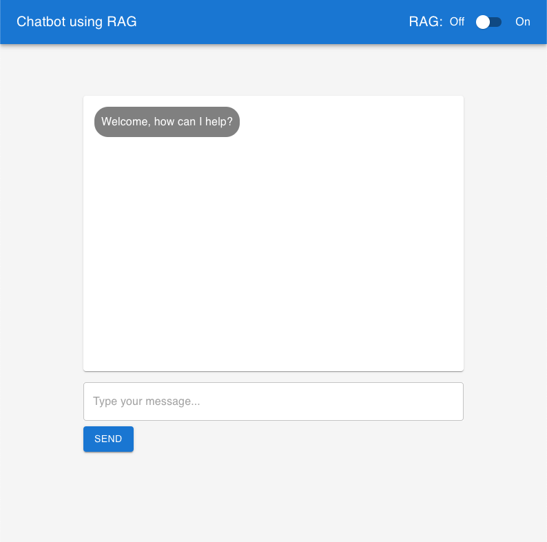
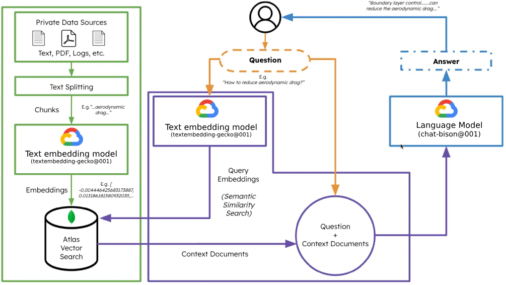

# Chat Application with RAG Feature Toggle and Backend Server

This project consists of a frontend chat application built using React and Material UI, and a backend server built with Express.js, MongoDB, and Google Cloud AI Platform. The frontend allows users to send and receive messages in real-time, automatically scrolls to the latest message, and includes a toggle switch to enable or disable the RAG (Retrieval-Augmented Generation) feature. The backend handles HTTP requests, interacts with a MongoDB database for persisting data, and uses Google Cloud's AI Platform for generating chatbot responses and text embeddings.



## Features

- **Real-Time Messaging**: Users can send and receive messages instantly.
- **Smooth Scrolling**: Automatically scrolls to the latest message for a seamless chat experience.
- **RAG Feature Toggle**: A switch to enable or disable the RAG feature, which can alter the chatbot's response behavior.
- **Responsive Design**: Built with Material UI for a responsive and material design look.
- **Backend Server**: Handles HTTP requests, interacts with MongoDB for data persistence, and uses Google Cloud AI Platform for generating chatbot responses.



> ### Refer to Step by Step guide for details in deploying: ["StepByStep"](STEPBYSTEP.md).

## Environment Setup

- **MongoDB**: Ensure your MongoDB instance is accessible and you have access to the connection string.
- **Google Cloud AI Platform**: Setup your Google Cloud project.
- **Frontend**:Make sure to change the parameters in the `frontend/config.js` file to suit your environment.
- **Backend**:Make sure to change the parameters in the `backend/config.json` file to suit your environment.

### MongoDB

- Deploy a free Atlas Cluster.
  Refer to:
  https://www.mongodb.com/docs/atlas/tutorial/deploy-free-tier-cluster/

- Generate the embeddings using the supplied `backend/processPdf.js` script.

- Create a Vector Search Index. Refer to: https://www.mongodb.com/docs/atlas/atlas-vector-search/create-index/

Vector Search Index definition

```json
{
  "fields": [
    {
      "numDimensions": 768,
      "path": "embedding",
      "similarity": "euclidean",
      "type": "vector"
    }
  ]
}
```

### Google Cloud AI Platform

To setup and enable the required API and services refer to: https://cloud.google.com/vertex-ai/docs/start/cloud-environment

## Installation

### Frontend

Clone the repository and install the dependencies:

```bash
git clone <repository-url>
cd <project-directory>/frontend
npm install
```

### Backend

Ensure you have MongoDB and Google Cloud credentials configured. Navigate to the backend directory and install the dependencies:

```bash
cd <project-directory>/backend
npm install
```

### PDF Processing and Embedding Storage

This section focuses on processing PDF files to extract text, generate embeddings for each sentence, and store these embeddings along with the text in a MongoDB database. This functionality supports the RAG feature by allowing the chatbot to retrieve relevant information from a collection of PDF documents.

#### Implementation Details

- **PDF Parsing**: Utilizes the `pdf-parse` library to read PDF files and extract text data. Each sentence in the PDF is identified and processed individually.
- **Embedding Generation**: Sends each extracted sentence to the `/embedding` endpoint of the backend server, which generates embeddings using the Google Cloud AI Platform.
- **MongoDB Storage**: Each sentence, along with its embedding and metadata (e.g., the file name and page number), is stored in a MongoDB database. This setup facilitates efficient retrieval of relevant information based on query embeddings.

#### Process Flow

1. **PDF File Reading**: Iterates over PDF files stored in a specified directory, reading each file and extracting its text content.
2. **Sentence Extraction and Embedding Generation**: Splits the text content into sentences, generates embeddings for each sentence via a REST API call to the backend server, and then stores these embeddings along with the sentence text in MongoDB.
3. **Metadata Handling**: Keeps track of the PDF file name and the page number for each sentence to provide context for the chatbot's responses.

#### Usage

To run this process, ensure your MongoDB instance is accessible and that the backend server is running with the `/embedding` endpoint configured to accept text and return embeddings. Execute the script to process all PDF files in the specified directory, extracting text, generating embeddings, and storing the data in MongoDB for use by the chatbot.

```bash

node processPdf.js

```

This additional capability enriches the chatbot's responses with information extracted from a predefined set of documents, making it more useful for answering queries with specific, document-based knowledge.

## Usage

### Start the Frontend

Run the frontend application locally:

```bash
npm start
```

Navigate to `http://localhost:3000` to view the application.

### Start the Backend Server

Run the backend server:

```bash
node server.js
```

The server will start on the default port 5050, or a port specified by the `config.js` file.

## Contributing

Contributions are welcome! Please feel free to submit a pull request with any improvements or bug fixes.

## License

This project is open-sourced under the MIT License.

## Credit

Written by:
Emil Nildersen  
Senior Solutions Architect - MongoDB
